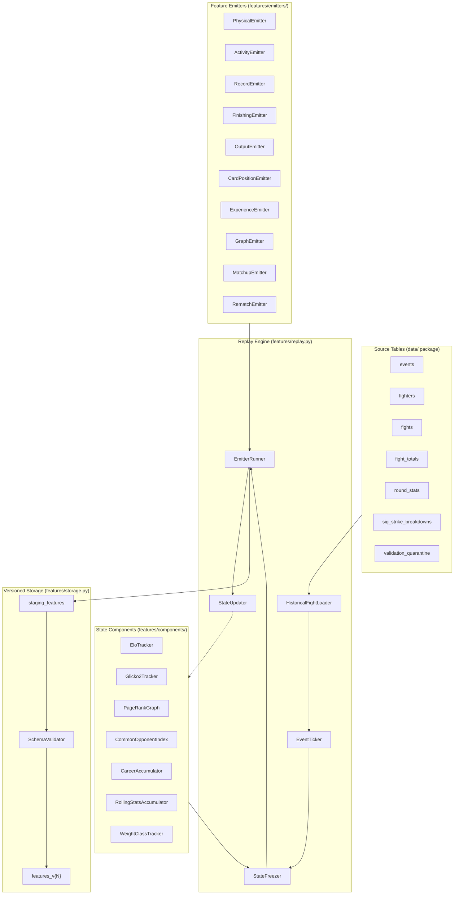

# Feature Engine — Design

## Overview

The feature engine is a batch replay system that walks UFC history event-by-event,
accumulates fighter state in typed components, and emits a versioned wide feature table.
It owns no labels, no market data, and no model logic — its sole output is the
`features_v{N}` DuckDB table consumed by the model assembler.

Two load-bearing ideas define the architecture:

1. **Event-atomic ticks with emit-before-update.** Every event is one indivisible step.
   State is frozen, features are emitted for all fights on the card, then outcomes
   update components. This eliminates intra-card information leakage without requiring
   sub-event timestamps that UFCStats does not provide.

2. **Protocol-driven composition.** State accumulation (`StateComponent`) and feature
   emission (`FeatureEmitter`) are separate protocol contracts. Emitters receive a
   frozen `EmitContext` that structurally cannot expose labels or market data. Adding a
   feature family means adding one component and one emitter with no changes to the
   replay engine.

The deployment target is a single-machine batch command (`make features`) operating on
the local DuckDB file. There is no streaming, no distributed execution, and no API.

## Architecture



### Component topology

- **HistoricalFightLoader** — SQL reader that joins `events`, `fights`, `fighters`,
  `fight_totals`, `round_stats`, `sig_strike_breakdowns` minus quarantined rows into
  typed `HistoricalFight` views ordered by `(event_date, event_url, fight_url)`.
- **EventTicker** — groups loaded fights by event, yields one tick per event in order.
- **StateFreezer** — calls `freeze()` on every registered StateComponent, producing
  read-only snapshots passed into `EmitContext`.
- **EmitterRunner** — iterates registered emitters per fight × orientation, collects
  results, validates column names against the registry schema.
- **StateUpdater** — after emission, calls `update()` on each component for every
  resolved fight in the tick.

### Development-to-production deltas

| Aspect | Development | Production |
|---|---|---|
| DuckDB path | `data/ufc_edge.duckdb` (local) | Same (single-machine batch) |
| Fixture mode | In-memory DuckDB, 5-event fixture | Full history |
| FEATURE_VERSION | Incremented on each schema change | Same |
| Graph config | `configs/graph.yaml` (local) | Same YAML, no env override needed |
| Parallelism | None (sequential) | None (correctness > speed) |

### Test ladder

| Level | What | Fixture size | Runtime target |
|---|---|---|---|
| Unit | Individual emitters with mocked EmitContext | 1 fight | <1s per emitter |
| Component | StateComponent update + freeze correctness | 5 events | <5s |
| Integration | Full replay on fixture → table materialization | 5 events, 30 fights | <30s |
| Property | Deletion oracle, same-card, determinism, symmetry | 5 events, 30 fights | <60s |
| Regression | Full replay on production data, schema match | Full DB | <10 min |

## Components and Interfaces

### Component 1 — HistoricalFightLoader (no LLM)

Reads source tables via SQL, applies the quarantine anti-join, and returns a sorted
list of `HistoricalFight` frozen dataclass instances. It does NOT read `features_v{N}`,
`order_book_snapshots`, `report_runs`, or `paper_signals`. It does NOT filter by
`label_start_date` — all history feeds state components.

**File:** `src/ufc_edge/features/loader.py`

**Interface:**
```python
def load_historical_fights(conn: duckdb.DuckDBPyConnection) -> list[HistoricalFight]: ...
```

### Component 2 — EventTicker (no LLM)

Groups `HistoricalFight` objects by `(event_date, event_url)` and yields `EventTick`
frozen dataclasses in chronological order. Each tick contains all fights for that event
sorted by `fight_url`.

**File:** `src/ufc_edge/features/replay.py`

### Component 3 — StateComponent Protocol and Implementations (no LLM)

The protocol defines `update(fight: FightOutcomeView) -> None` and
`freeze() -> FrozenState`. Each implementation accumulates one concern:

| Class | File | State shape |
|---|---|---|
| `EloTracker` | `src/ufc_edge/features/components/elo.py` | `dict[str, EloRecord]` |
| `Glicko2Tracker` | `src/ufc_edge/features/components/glicko2.py` | `dict[str, Glicko2Record]` |
| `PageRankGraph` | `src/ufc_edge/features/components/pagerank.py` | `networkx.DiGraph` + score cache |
| `CommonOpponentIndex` | `src/ufc_edge/features/components/common_opponents.py` | `dict[str, list[OpponentRecord]]` |
| `CareerAccumulator` | `src/ufc_edge/features/components/career.py` | `dict[str, CareerState]` |
| `RollingStatsAccumulator` | `src/ufc_edge/features/components/rolling_stats.py` | `dict[str, deque[FightStats]]` |
| `WeightClassTracker` | `src/ufc_edge/features/components/weight_class.py` | `dict[str, WeightHistory]` |

`freeze()` returns a deeply-frozen (immutable) copy. Mutation of the returned object
raises `FrozenStateError`.

### Component 4 — EmitContext (no LLM)

**File:** `src/ufc_edge/features/contracts.py`

A frozen dataclass providing:
```
EmitContext {
  fighter_url:       str
  fighter_profile:   FighterProfile              // height, reach, stance, dob
  opponent_url:      str
  opponent_profile:  FighterProfile
  event_date:        date
  event_url:         str
  weight_class:      str
  fight_url:         str
  bout_order:        int | None                  // None until scraper extension
  components:        Mapping[str, FrozenState]   // read-only component snapshots
}
```

It does NOT contain: `winner_url`, `method`, market data, DuckDB connections, or any
mutable reference.

### Component 5 — FeatureEmitter Implementations (no LLM)

Each emitter is a stateless function object. It reads from `EmitContext.components` and
fighter profiles, returning a flat dict of column→value. Emitters are grouped by
family; the registry controls activation.

| Emitter | File | Family | Key outputs |
|---|---|---|---|
| `PhysicalEmitter` | `src/ufc_edge/features/emitters/physical.py` | §1 | height_cm, reach_cm, age_at_fight, stance |
| `ActivityEmitter` | `src/ufc_edge/features/emitters/activity.py` | §2 | days_since_last_fight, inactivity_tier |
| `RecordEmitter` | `src/ufc_edge/features/emitters/record.py` | §3/3a | win_pct_all, is_ufc_debut, debut_opp_* |
| `FinishingEmitter` | `src/ufc_edge/features/emitters/finishing.py` | §4/4a | finish_rate, ko_rate, never_been_finished |
| `OutputEmitter` | `src/ufc_edge/features/emitters/output.py` | §5 | sig_strikes_per_min, damage_ratio |
| `CardPositionEmitter` | `src/ufc_edge/features/emitters/card_position.py` | §5a | sig_strikes_main_card_avg (gated) |
| `ExperienceEmitter` | `src/ufc_edge/features/emitters/experience.py` | §6 | title_fight_experience, five_round_win_pct |
| `WeightDominanceEmitter` | `src/ufc_edge/features/emitters/weight.py` | §8a/8b | is_weight_class_change, weight_bully_score |
| `GraphEmitter` | `src/ufc_edge/features/emitters/graph.py` | §9a/9b/9c | elo_rating, glicko2_*, pagerank_*, common_opp_* |
| `MatchupEmitter` | `src/ufc_edge/features/emitters/matchup.py` | §10/10a/10b | reach_delta, wrestling_delta, pace_mismatch |
| `RematchEmitter` | `src/ufc_edge/features/emitters/rematch.py` | §11 | is_rematch, first_meeting_competitive |
| `WeightCutEmitter` | `src/ufc_edge/features/emitters/weight_cut.py` | §15 det. | missed_weight_last_3, moving_down_in_weight |

### Component 6 — Feature Registry (no LLM)

**File:** `src/ufc_edge/features/registry.py`

Owns the canonical schema: maps emitter name → output columns with declared types.
Validates at startup (no duplicates, all families present, types in `{float, str, None}`).
Exposes `schema()` for storage validation and `families()` for ordered iteration.

### Component 7 — Feature Storage and Versioning (no LLM)

**File:** `src/ufc_edge/features/storage.py`, `src/ufc_edge/features/versioning.py`

`versioning.py`: computes source hash, reads/writes manifest (`features_version_manifest.json`),
exposes `check_version_integrity() -> bool`.

`storage.py`: DDL for `features_v{N}`, staging table write, row-count + PK-uniqueness
validation, atomic swap (`ALTER TABLE ... RENAME`), provenance columns.

## Data Models

### HistoricalFight

```
HistoricalFight {
  fight_url:          str                       // PK
  event_url:          str
  event_date:         date
  fighter_a_url:      str
  fighter_b_url:      str
  winner_url:         str | None                // None = draw/NC
  method:             str
  ending_round:       int
  ending_time:        str
  time_format:        str
  weight_class:       str
  bout_order:         int | None                // None until scraper extension
  fighter_a_profile:  FighterProfile
  fighter_b_profile:  FighterProfile
  fighter_a_totals:   FightTotals | None
  fighter_b_totals:   FightTotals | None
}
```

### FighterProfile

```
FighterProfile {
  fighter_url:    str
  height_cm:      float | None
  reach_cm:       float | None
  stance:         str | None                    // Orthodox | Southpaw | Switch
  dob:            date | None
}
```

### FightOutcomeView

```
FightOutcomeView {
  fight_url:      str
  event_url:      str
  event_date:     date
  fighter_a_url:  str
  fighter_b_url:  str
  winner_url:     str | None
  method:         str
  ending_round:   int
  ending_time:    str
  weight_class:   str
  bout_order:     int | None
}
```

### EloRecord

```
EloRecord {
  rating:         float                         // current Elo
  peak:           float                         // lifetime max
  history:        list[float]                   // last N ratings for trajectory
  last_fight_date: date
  fight_count:    int
}
```

### Glicko2Record

```
Glicko2Record {
  mu:             float                         // rating
  rd:             float                         // rating deviation
  sigma:          float                         // volatility
  last_fight_date: date
  fight_count:    int
}
```

### EventTick

```
EventTick {
  event_url:      str
  event_date:     date
  fights:         list[HistoricalFight]         // sorted by fight_url
}
```

### FeatureRow

```
FeatureRow {
  fight_url:          str                       // PK part 1
  fighter_url:        str                       // PK part 2
  event_url:          str
  event_date:         date
  opponent_url:       str
  weight_class:       str
  feature_version:    str
  generated_at:       datetime
  // ... all registered feature columns as float | str | None
}
```

### VersionManifest

```
VersionManifest {
  version:        str                           // e.g., "v1"
  source_hash:    str                           // SHA-256 of feature package
  changelog:      str
  created_at:     datetime
}
```

## DuckDB DDL

```sql
CREATE TABLE IF NOT EXISTS features_v1 (
    fight_url       VARCHAR NOT NULL,
    fighter_url     VARCHAR NOT NULL,
    event_url       VARCHAR NOT NULL,
    event_date      DATE NOT NULL,
    opponent_url    VARCHAR NOT NULL,
    weight_class    VARCHAR,
    feature_version VARCHAR NOT NULL,
    generated_at    TIMESTAMP NOT NULL,
    -- §1 Physical
    height_cm       DOUBLE,
    reach_cm        DOUBLE,
    reach_to_height_ratio DOUBLE,
    stance          VARCHAR,
    age_at_fight    DOUBLE,
    -- §2 Activity (truncated for brevity — full columns from registry)
    days_since_last_fight DOUBLE,
    inactivity_tier INTEGER,
    -- ... all feature columns ...
    -- §9 Graph
    elo_rating      DOUBLE,
    elo_trajectory_last5 DOUBLE,
    elo_peak        DOUBLE,
    elo_current_vs_peak DOUBLE,
    glicko2_rating  DOUBLE,
    glicko2_rd      DOUBLE,
    pagerank_score  DOUBLE,
    n_common_opponents INTEGER,
    common_opp_score_delta DOUBLE,
    -- PK
    PRIMARY KEY (fight_url, fighter_url)
);
```

## Graph Configuration Contract

**File:** `configs/graph.yaml`

```yaml
elo:
  initial_rating: 1500
  k_base: TODO(human)
  method_bonus_map:
    KO/TKO: TODO(human)
    Submission: TODO(human)
    Decision: 0.0
  recency_weight_halflife: TODO(human)
  inactivity_decay_rate: TODO(human)
  inactivity_period_days: 180
  dq_k_multiplier: 0.1
  injury_stoppage_k: 0

glicko2:
  initial_mu: 1500
  initial_rd: 350
  tau: TODO(human)
  rating_period_days: TODO(human)
  high_uncertainty_threshold: TODO(human)

pagerank:
  damping: 0.85
  finish_type_bonus_map:
    KO/TKO: TODO(human)
    Submission: TODO(human)
    Decision: 0.0
  recency_decay_lambda: TODO(human)
  early_finish_bonus: TODO(human)
  convergence_tolerance: 1.0e-6
  max_iterations: 100

common_opponents:
  lookback_years: 3
  recency_decay_lambda: TODO(human)
  quality_weight_elo: TODO(human)
  quality_weight_pagerank: TODO(human)
```

## Error Handling

Ranked by danger:

1. **Source-hash mismatch (highest).** Feature code changed without version bump.
   Behavior: abort before any write; emit clear error with expected vs actual hash.
   No partial state.

2. **Registry schema violation.** Duplicate columns, unknown types, missing families.
   Behavior: abort at startup; no replay begins.

3. **Staging validation failure.** Duplicate PKs or unexpected row count after replay.
   Behavior: drop staging table; leave prior `features_v{N}` intact; report counts.

4. **Component update error.** A StateComponent raises during `update()`.
   Behavior: abort the entire generation run (features are all-or-nothing); log the
   fight and component that failed.

5. **Emitter error.** An emitter raises or returns invalid keys during `emit()`.
   Behavior: abort the run; report the emitter name, fight, and error. No partial table.

6. **Missing source data.** A fighter has no totals row or missing profile fields.
   Behavior: emitter returns `None` for affected columns; replay continues. This is
   expected for early-career fighters.

## Correctness Properties

### Property 1: Temporal isolation (deletion oracle)

*For any* fight `X`, removing `X` and all temporally-later source data from the input,
then replaying, produces a feature row for `X` that is byte-identical to the
full-replay row. This proves `X`'s features depend only on strictly-prior information.

**Validates: Requirements FE-1.1, FE-1.2, FE-2.1**

### Property 2: Same-card isolation

*For any* event `E` and fight `F` in `E`, altering or removing another fight `G` on `E`
(where `G ≠ F`) does not change `F`'s feature row. This proves the event-atomic tick
prevents intra-card leakage.

**Validates: Requirements FE-1.1, FE-1.4**

### Property 3: Determinism

*For any* fixed input data and configuration, running the full replay produces identical
output rows (same values, same ordering, same schema) across multiple executions,
regardless of system clock or platform.

**Validates: Requirements FE-1.3, FE-4.7**

### Property 4: Symmetry-input consistency

*For any* fight `(A, B)`, the features emitted for orientation (A as focal, B as opponent)
and orientation (B as focal, A as opponent) are related by: absolute features match their
respective fighter, delta features have opposite signs, and derived features (e.g.,
`damage_ratio`) are computed from the focal fighter's own data.

**Validates: Requirements FE-1.8, FE-8.7**

### Property 5: EmitContext opacity

*For any* emitter invocation, the `EmitContext` object contains no attribute or method
that exposes: the fight's `winner_url`, any `order_book_snapshots` data, a writable
reference to any StateComponent, or a DuckDB connection handle.

**Validates: Requirements FE-2.1, FE-2.2, FE-2.3, FE-2.5**

### Property 6: Source-hash fidelity

*For any* pair `(committed_manifest, current_source_files)`, if even one byte of a
Python file in `src/ufc_edge/features/` differs from the manifest's recorded hash, the
system refuses to generate features before touching any table.

**Validates: Requirements FE-3.1, FE-3.2**

### Property 7: Atomic write safety

*For any* generation run, either the full output table is written atomically (all rows,
correct schema, validated PKs) or no change occurs to the existing `features_v{N}` table.
There is no state in which a partial or schema-inconsistent table is visible.

**Validates: Requirements FE-4.2, FE-4.3**

### Property 8: No label contamination

The `features_v{N}` table contains no column named `winner_url`, `outcome`, `label`,
or any derivative of fight result. Labels are joined only by the model assembler.

**Validates: Requirements FE-4.5**

### Property 9: No market contamination

The `features_v{N}` table contains no column derived from `order_book_snapshots` or
any market source. No import path exists from `ufc_edge.data.polymarket` to
`ufc_edge.features`.

**Validates: Requirements FE-4.6**

### Property 10: Registry guards

The Feature_Registry rejects at startup: (a) duplicate column names, (b) return types
outside `{float, str, None}`, (c) missing families referenced in configuration. At
emit time, it rejects keys not in the emitter's declared columns.

**Validates: Requirements FE-11.1, FE-11.2, FE-11.3, FE-11.8**

### Property 11: Graph temporal safety

*For any* event `E`, the Elo, Glicko-2, PageRank, and common-opponent features emitted
for fights in `E` reflect only outcomes from events strictly before `E`. No outcome
from `E` or later is incorporated.

**Validates: Requirements FE-5.2, FE-6.2, FE-7.1**

### Property 12: Elo-neutral outcomes

Fights ending by injury stoppage receive K=0 (no Elo change) and DQ outcomes receive
K×0.1. Glicko-2 similarly does not update for injury stoppages.

**Validates: Requirements FE-5.3, FE-5.4, FE-6.5**

## Testing Strategy

- **Unit tests per emitter:** mock EmitContext with known component states; assert
  exact output values for each feature column.
- **Unit tests per StateComponent:** update with known outcomes; verify freeze produces
  expected immutable snapshots.
- **Integration test:** full replay on 5-event fixture → validate table schema, row
  count (2 × fight_count), PK uniqueness, no NULLs in metadata columns.
- **Property tests (leakage suite):** deletion oracle, same-card isolation, determinism,
  symmetry — parametrized over fixture fights.
- **Registry tests:** attempt duplicate columns, bad types, missing families, stale
  hash — all must raise `RegistryError`.
- **Version guard test:** tamper with a source file → verify generation aborts.
- **Import firewall test:** verify no import path from `features` → `polymarket` or
  `features` → fight outcomes (grep/AST check).

## Standing Decisions with Named Fallbacks

1. **Event-atomic ticks (D13/D14).** The replay engine treats each event as one atomic
   tick because sub-event ordering is not reliably available from UFCStats. If a future
   source provides verified within-event fight ordering with timestamps, evaluate
   fight-level ticks before any architecture change.

2. **Elo as primary schedule-strength signal.** Elo is the primary opponent-quality
   measure. If the D29 ablation ladder shows Glicko-2 subsumes Elo's incremental
   value, evaluate dropping Elo emitter before adding complexity.

3. **§5a gated on bout_order (card-position verdict: DERIVABLE).** Bout order is
   derivable from DOM position but not yet persisted. A scraper extension task is
   required before §5a features activate. If scraper extension proves infeasible,
   mark all §5a features permanently deferred.

4. **Kaggle admission protocol (D30).** No Kaggle field enters until it passes
   per-field validation. If Kaggle dataset update cadence degrades below annual or
   provenance becomes untraceable, evaluate dropping Kaggle-gated features entirely.
