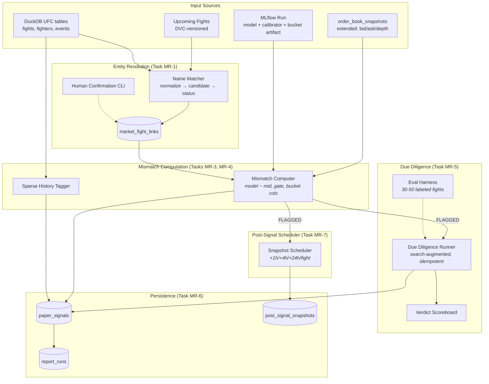

# Design Document — Mismatch Report and Paper-Signal Log

## Overview

This design implements the mismatch report pipeline for UFCPolyML v1: persisted
entity resolution, capture schema extensions, magnitude-gated mismatch computation
with bucket transparency, sparse-history annotation, LLM due-diligence annotation,
and append-only paper-signal persistence.

The two load-bearing ideas are:

1. **Materialized linkage, not recomputed matching.** The `market_fight_links` table
   is the single source of truth for all fight↔market joins. Name matching writes
   candidates once; human confirmation upgrades ambiguous rows. No downstream module
   re-derives the link. This makes evaluation reproducible and matching-logic changes
   harmless to historical records.

2. **Annotate and expose, never suppress.** The magnitude gate, bucket transparency,
   sparse-history tag, and LLM verdict all exist to *inform* a human decision. No
   automated suppression, no auto-veto, no position sizing. Every signal survives to
   the record; the human sees the evidence and decides.

Deployment target: local batch CLI commands orchestrated by `Makefile`. DuckDB is the
sole datastore; Hydra resolves all thresholds; MLflow provides the calibrated model
and stratified reliability artifact.

## Architecture



### Deployment model

All commands run locally via the Makefile:

```text
make report AS_OF=<ISO-8601> RUN_ID=<mlflow-run-id>   # full pipeline
make match-review                                       # human confirmation CLI
make due-diligence-eval                                 # eval harness
make verdict-scoreboard                                 # scoreboard query
```

### Development-to-production deltas

| Aspect | Development | Production |
|---|---|---|
| DuckDB path | `data/ufc_edge.duckdb` | same (single-machine batch) |
| LLM model | stubbed/mocked | configured model via Hydra |
| Post-signal scheduler | immediate (fixture timestamps) | real wall-clock delays |
| Eval harness | full 30–50 fight fixture set | same fixtures |

### Test ladder

| Level | Scope | Runner |
|---|---|---|
| Unit | Name normalization, gate math, schema validation, idempotency | `pytest` fixtures |
| Integration | Link table round-trip, report pipeline end-to-end with stubbed model | `pytest` + tmp DuckDB |
| Eval gate | Due-diligence precision/recall on labeled set | `make due-diligence-eval` |
| Regression | Deterministic report output given fixed inputs | snapshot comparison |

## Components and Interfaces

### Component 1 — Link Resolver (`report.matching`) (no LLM)

Owns entity resolution between Polymarket tokens and UFC fights. Writes to
`market_fight_links`. Does NOT invoke the LLM. Does NOT assume market data is
available — records `MISSING_SNAPSHOT` when no capture exists.

**Module:** `src/ufc_edge/report/matching.py`

**Functions:**

- `normalize_name(raw: str) -> str` — lowercase, NFD + combining-mark strip,
  whitespace collapse, punctuation removal.
- `resolve_links(fights: list[UpcomingFight], as_of: datetime, conn: DuckDBConnection) -> list[MarketFightLink]`
  — for each fight, check existing links first (reuse); if absent, run name matching
  against active markets, write result.
- `get_unresolved(conn: DuckDBConnection) -> list[MarketFightLink]` — returns all rows
  with non-MATCHED status and no `reviewed_by`.

**Correctness contract:** Once a row reaches `MATCHED`, it is immutable. The function
is idempotent: calling `resolve_links` with the same fight list produces no new rows
if links already exist.

### Component 2 — Human Confirmation CLI (`report.confirm_cli`) (no LLM)

A CLI command (`python -m ufc_edge.report.confirm_cli`) that displays unresolved links
and accepts human input. Writes `reviewed_by` and upgrades status.

**Module:** `src/ufc_edge/report/confirm_cli.py`

**Functions:**

- `display_unresolved(links: list[MarketFightLink]) -> None` — grouped by event date.
- `confirm_link(link_id: str, token_id: str, reviewer: str, conn: DuckDBConnection) -> None`
  — validates token exists, updates row.

### Component 3 — Capture Schema Extension (`data.polymarket`) (no LLM)

Extends `order_book_snapshots` DDL and `OrderBookSnapshot` Pydantic model with
`best_bid`, `best_ask`, `best_bid_size`, `best_ask_size`. Existing rows have NULL for
new columns. Extraction logic reads `bids[0]` and `asks[0]` from the already-captured
order book.

**Modified files:**
- `src/ufc_edge/data/polymarket/schemas.py` — add fields.
- `src/ufc_edge/data/polymarket/storage.py` — extend DDL and INSERT.
- `src/ufc_edge/data/polymarket/capture.py` — extract top-of-book.

### Component 4 — Mismatch Computer (`report.mismatch`) (no LLM)

Computes the signed mismatch, applies the magnitude gate, attaches bucket transparency
columns, and tags sparse history.

**Module:** `src/ufc_edge/report/mismatch.py`

**Functions:**

- `compute_mismatch(p_model: float, p_market_mid: float) -> float` — pure arithmetic.
- `apply_gate(mismatch: float, p_model: float, bucket_artifact: BucketArtifact, k: float) -> GateResult`
  — returns `GateResult(verdict=FLAGGED|WITHIN_NOISE|NO_BUCKET_DATA, bucket_id, bucket_n, bucket_error, ci_lower, ci_upper)`.
- `tag_sparse_history(fighter_a_url: str, fighter_b_url: str, fight_url: str, conn: DuckDBConnection, threshold: int) -> SparseHistoryResult`
  — counts prior fights, returns `(min_prior_ufc_fights, sparse_history: bool)`.

**Bucket assignment:** Buckets are `[0.1–0.3)`, `[0.3–0.5)`, `[0.5–0.7)`, `[0.7–0.9]`.
A probability on a boundary is assigned to the lower bucket. Probabilities outside
[0.1, 0.9] use the nearest boundary bucket.

### Component 5 — Due-Diligence Runner (`report.due_diligence`) (LLM)

Search-augmented LLM runner invoked only for FLAGGED signals. Returns a structured
verdict validated against a frozen Pydantic schema. Idempotent per `(fight_url,
report_run_id)`.

**Module:** `src/ufc_edge/report/due_diligence.py`

**Functions:**

- `run_due_diligence(fight_url: str, report_run_id: str, fighter_a: str, fighter_b: str, event_date: date, conn: DuckDBConnection, config: DueDiligenceConfig) -> DueDiligenceVerdict | None`
  — checks for existing verdict first (idempotency); if absent, invokes the search +
  LLM pipeline; validates response against schema; persists and returns.

**Checklist (prompt-encoded):** injury news, weight-cut concern, short-notice
replacement, camp change, other material pre-fight news.

**Logging:** Every invocation writes `prompt_version`, `model_name`, `model_version`,
`invoked_at`, `response_latency_ms` to `due_diligence_runs`.

### Component 6 — Eval Harness (`report.due_diligence_eval`) (LLM)

Runs the production due-diligence runner on a hand-labeled fixture set and computes
precision and recall. Gates at P ≥ 0.80, R ≥ 0.60.

**Module:** `src/ufc_edge/report/due_diligence_eval.py`

**Fixture:** `tests/fixtures/due_diligence_labels.json` — 30–50 entries with
`fight_url`, `event_date`, `fighter_a`, `fighter_b`, `ground_truth_verdict`, and
`notes`.

**Functions:**

- `run_eval(config: DueDiligenceConfig) -> EvalResult` — invokes runner on each
  fixture, computes confusion matrix, returns precision/recall/F1.
- `gate_check(result: EvalResult) -> bool` — returns True iff P ≥ 0.80 and R ≥ 0.60.

### Component 7 — Verdict Scoreboard (`report.scoreboard`) (no LLM)

Tracks resolved outcomes for fights that received CONFIRM or VETO verdicts.

**Module:** `src/ufc_edge/report/scoreboard.py`

**Functions:**

- `update_scoreboard(conn: DuckDBConnection) -> None` — joins verdicts with resolved
  fight outcomes; updates `verdict_scoreboard` table.
- `query_scoreboard(conn: DuckDBConnection) -> ScoreboardSummary` — per-verdict
  counts, win rates, mean absolute mismatch.

### Component 8 — Post-Signal Snapshot Scheduler (`report.snapshots`) (no LLM)

Schedules and captures post-signal market re-reads at T+1h, T+4h, T+24h, fight-time.

**Module:** `src/ufc_edge/report/snapshots.py`

**Functions:**

- `schedule_snapshots(signal_id: str, token_id: str, signal_time: datetime, event_start: datetime | None, conn: DuckDBConnection) -> list[ScheduledSnapshot]`
  — computes target times, writes schedule rows.
- `execute_pending_snapshots(conn: DuckDBConnection) -> CaptureResult` — reads pending
  schedule rows, captures current market state, writes results or MISSED status.

### Component 9 — Report Runner (`report.runner`) (no LLM)

Orchestrates one full report pipeline execution. Creates `report_runs` row, iterates
bouts, invokes matching/mismatch/annotation, writes `paper_signals`.

**Module:** `src/ufc_edge/report/runner.py`

**Functions:**

- `run_report(as_of: datetime, mlflow_run_id: str, config: ReportConfig, conn: DuckDBConnection) -> ReportRun`
  — the top-level orchestrator.

### Component 10 — Report Storage (`report.storage`) (no LLM)

Owns DDL and write functions for `market_fight_links`, `report_runs`, `paper_signals`,
`post_signal_snapshots`, `due_diligence_verdicts`, `due_diligence_runs`,
`verdict_scoreboard`.

**Module:** `src/ufc_edge/report/storage.py`

## Data Models

### MarketFightLink

```
MarketFightLink {
  fight_url:       str                       // FK to fights.fight_url
  token_id:        str                       // FK to order_book_snapshots.token_id
  match_status:    MATCHED | NO_CANDIDATE | MULTIPLE_CANDIDATES | INVALID_INPUT | MISSING_SNAPSHOT
  match_method:    AUTO_NAME | HUMAN_CONFIRMED | MANUAL_OVERRIDE | null
  candidate_count: int | null                // populated for MULTIPLE_CANDIDATES
  matched_at:      datetime
  reviewed_by:     str | null                // human alias if confirmed
}
```

### PaperSignal

```
PaperSignal {
  signal_id:              str (UUID)
  report_run_id:          str (UUID)         // FK to report_runs
  fight_url:              str
  event_date:             date
  fighter_a_url:          str
  fighter_b_url:          str
  fighter_a_name:         str
  fighter_b_name:         str
  weight_class:           str
  market_id:              str | null
  token_id:               str | null
  snapshot_timestamp:     datetime | null
  tick_id:                str | null
  p_model:                float | null
  p_market_mid:           float | null
  best_bid:               float | null
  best_ask:               float | null
  best_bid_size:          float | null
  best_ask_size:          float | null
  mismatch:               float | null
  gate_verdict:           FLAGGED | WITHIN_NOISE | NO_BUCKET_DATA | null
  bucket_id:              str | null
  bucket_n:               int | null
  bucket_calibration_error: float | null
  bucket_ci_lower:        float | null
  bucket_ci_upper:        float | null
  min_prior_ufc_fights:   int | null
  sparse_history:         bool
  match_status:           MATCHED | NO_CANDIDATE | MULTIPLE_CANDIDATES | INVALID_INPUT | MISSING_SNAPSHOT
  mlflow_run_id:          str
  data_revision:          str
  feature_version:        str
  config_hash:            str
  created_at:             datetime
}
```

### ReportRun

```
ReportRun {
  report_run_id:    str (UUID)
  as_of_timestamp:  datetime
  mlflow_run_id:    str
  data_revision:    str
  feature_version:  str
  config_hash:      str
  bout_count:       int
  flagged_count:    int
  created_at:       datetime
}
```

### DueDiligenceVerdict (frozen Pydantic)

```
DueDiligenceVerdict {
  fight_url:          str
  report_run_id:      str
  verdict:            CONFIRM | QUALIFY | VETO
  confidence:         float                    // [0.0, 1.0]
  evidence_urls:      list[str]                // at least one
  summary:            str                      // 1-3 sentence explanation
  checklist_findings: ChecklistFindings        // structured sub-object
  prompt_version:     str
  model_name:         str
  model_version:      str
  invoked_at:         datetime
}
```

### ChecklistFindings

```
ChecklistFindings {
  injury_news:             Finding | null
  weight_cut_concern:      Finding | null
  short_notice_replacement: Finding | null
  camp_change:             Finding | null
  other_material_news:     Finding | null
}

Finding {
  present:     bool
  detail:      str
  source_url:  str
}
```

### PostSignalSnapshot

```
PostSignalSnapshot {
  snapshot_id:       str (UUID)
  signal_id:         str                      // FK to paper_signals
  token_id:          str
  scheduled_offset:  1H | 4H | 24H | FIGHT_TIME
  scheduled_at:      datetime
  actual_captured_at: datetime | null
  status:            CAPTURED | MISSED | SKIPPED
  failure_reason:    str | null
  best_bid:          float | null
  best_ask:          float | null
  best_bid_size:     float | null
  best_ask_size:     float | null
  mid_price:         float | null
  captured_at:       datetime | null
}
```

### GateResult

```
GateResult {
  verdict:                  FLAGGED | WITHIN_NOISE | NO_BUCKET_DATA
  bucket_id:                str
  bucket_n:                 int
  bucket_calibration_error: float
  ci_lower:                 float
  ci_upper:                 float
}
```

### BucketArtifact (consumed from ME spec)

```
BucketArtifact {
  buckets: list[BucketEntry]
}

BucketEntry {
  bucket_id:          str                    // e.g. "0.1-0.3"
  lower:              float
  upper:              float
  n:                  int
  calibration_error:  float
  ci_lower:           float
  ci_upper:           float
}
```

## DuckDB DDL

### market_fight_links

```sql
CREATE TABLE IF NOT EXISTS market_fight_links (
    fight_url       TEXT NOT NULL,
    token_id        TEXT NOT NULL,
    match_status    TEXT NOT NULL,
    match_method    TEXT,
    candidate_count INTEGER,
    matched_at      TIMESTAMP NOT NULL DEFAULT current_timestamp,
    reviewed_by     TEXT,
    PRIMARY KEY (fight_url, token_id)
);
```

### report_runs

```sql
CREATE TABLE IF NOT EXISTS report_runs (
    report_run_id   TEXT PRIMARY KEY,
    as_of_timestamp TIMESTAMP NOT NULL,
    mlflow_run_id   TEXT NOT NULL,
    data_revision   TEXT NOT NULL,
    feature_version TEXT NOT NULL,
    config_hash     TEXT NOT NULL,
    bout_count      INTEGER NOT NULL,
    flagged_count   INTEGER NOT NULL,
    created_at      TIMESTAMP NOT NULL DEFAULT current_timestamp
);
```

### paper_signals

```sql
CREATE TABLE IF NOT EXISTS paper_signals (
    signal_id                TEXT PRIMARY KEY,
    report_run_id            TEXT NOT NULL REFERENCES report_runs(report_run_id),
    fight_url                TEXT NOT NULL,
    event_date               DATE,
    fighter_a_url            TEXT NOT NULL,
    fighter_b_url            TEXT NOT NULL,
    fighter_a_name           TEXT NOT NULL,
    fighter_b_name           TEXT NOT NULL,
    weight_class             TEXT,
    market_id                TEXT,
    token_id                 TEXT,
    snapshot_timestamp       TIMESTAMP,
    tick_id                  TEXT,
    p_model                  DOUBLE,
    p_market_mid             DOUBLE,
    best_bid                 DOUBLE,
    best_ask                 DOUBLE,
    best_bid_size            DOUBLE,
    best_ask_size            DOUBLE,
    mismatch                 DOUBLE,
    gate_verdict             TEXT,
    bucket_id                TEXT,
    bucket_n                 INTEGER,
    bucket_calibration_error DOUBLE,
    bucket_ci_lower          DOUBLE,
    bucket_ci_upper          DOUBLE,
    min_prior_ufc_fights     INTEGER,
    sparse_history           BOOLEAN NOT NULL DEFAULT false,
    match_status             TEXT NOT NULL,
    mlflow_run_id            TEXT NOT NULL,
    data_revision            TEXT NOT NULL,
    feature_version          TEXT NOT NULL,
    config_hash              TEXT NOT NULL,
    created_at               TIMESTAMP NOT NULL DEFAULT current_timestamp
);
```

### post_signal_snapshots

```sql
CREATE TABLE IF NOT EXISTS post_signal_snapshots (
    snapshot_id       TEXT PRIMARY KEY,
    signal_id         TEXT NOT NULL REFERENCES paper_signals(signal_id),
    token_id          TEXT NOT NULL,
    scheduled_offset  TEXT NOT NULL,
    scheduled_at      TIMESTAMP NOT NULL,
    actual_captured_at TIMESTAMP,
    status            TEXT NOT NULL DEFAULT 'PENDING',
    failure_reason    TEXT,
    best_bid          DOUBLE,
    best_ask          DOUBLE,
    best_bid_size     DOUBLE,
    best_ask_size     DOUBLE,
    mid_price         DOUBLE,
    captured_at       TIMESTAMP
);
```

### due_diligence_verdicts

```sql
CREATE TABLE IF NOT EXISTS due_diligence_verdicts (
    fight_url       TEXT NOT NULL,
    report_run_id   TEXT NOT NULL,
    verdict         TEXT NOT NULL,
    confidence      DOUBLE NOT NULL,
    evidence_urls   TEXT NOT NULL,
    summary         TEXT NOT NULL,
    checklist_json  TEXT NOT NULL,
    prompt_version  TEXT NOT NULL,
    model_name      TEXT NOT NULL,
    model_version   TEXT NOT NULL,
    invoked_at      TIMESTAMP NOT NULL,
    PRIMARY KEY (fight_url, report_run_id)
);
```

### due_diligence_runs (logging)

```sql
CREATE TABLE IF NOT EXISTS due_diligence_runs (
    run_id           TEXT PRIMARY KEY,
    fight_url        TEXT NOT NULL,
    report_run_id    TEXT NOT NULL,
    prompt_version   TEXT NOT NULL,
    model_name       TEXT NOT NULL,
    model_version    TEXT NOT NULL,
    invoked_at       TIMESTAMP NOT NULL,
    response_latency_ms INTEGER,
    success          BOOLEAN NOT NULL,
    error_reason     TEXT
);
```

### verdict_scoreboard

```sql
CREATE TABLE IF NOT EXISTS verdict_scoreboard (
    fight_url        TEXT NOT NULL,
    report_run_id    TEXT NOT NULL,
    verdict          TEXT NOT NULL,
    mismatch_at_signal DOUBLE,
    fight_resolved   BOOLEAN NOT NULL DEFAULT false,
    outcome_correct  BOOLEAN,
    resolved_at      TIMESTAMP,
    PRIMARY KEY (fight_url, report_run_id)
);
```

## Hydra Configuration

**File:** `configs/report/default.yaml`

```yaml
gate:
  k: 2.0
  buckets:
    - id: "0.1-0.3"
      lower: 0.1
      upper: 0.3
    - id: "0.3-0.5"
      lower: 0.3
      upper: 0.5
    - id: "0.5-0.7"
      lower: 0.5
      upper: 0.7
    - id: "0.7-0.9"
      lower: 0.7
      upper: 0.9

sparse_history:
  min_prior_ufc_fights_threshold: 3

due_diligence:
  model_name: "claude-sonnet-4-20250514"
  prompt_version: "v1"
  search_provider: "tavily"
  max_evidence_urls: 5
  timeout_seconds: 30
  enabled: true

post_signal_snapshots:
  offsets_hours: [1, 4, 24]
  include_fight_time: true
  max_retries: 2

staleness:
  capture_max_age_minutes: 30
  report_max_age_days: 14
```

## Error Handling

Ranked by danger (highest first):

1. **Bucket artifact missing.** The report pipeline requires the stratified
   reliability artifact from the specified MLflow run. If absent, the pipeline fails
   before writing any rows — a report without bucket data is meaningless.

2. **LLM failure on a flagged signal.** The verdict is recorded as null with
   `error_reason`. The signal row is written; the report is not blocked. Repeated
   failures across a full run trigger a warning in the report summary but do not fail
   the run.

3. **Market match ambiguity.** Persisted as a non-MATCHED status. The signal row is
   written with null probability fields. No guessing, no suppression.

4. **Post-signal snapshot failure.** Recorded as MISSED with reason. Does not block
   the report or invalidate the original signal.

5. **Stale capture data.** If the most recent capture is older than the configured
   staleness threshold, the health command warns. The report pipeline proceeds but
   logs a warning.

## Correctness Properties

### Property 1: Link immutability

*For any* `market_fight_links` row with `match_status = MATCHED`, no subsequent
pipeline execution may overwrite, update, or delete that row. Re-running
`resolve_links` with the same inputs produces no new link rows for already-matched
fights.

**Validates: Requirements MR-1.2, MR-1.3**

### Property 2: Name normalization determinism

*For any* input string, `normalize_name` produces a single canonical form that is
stable across invocations. The function is pure: no external state, no locale
sensitivity, no randomness.

**Validates: Requirements MR-2.1**

### Property 3: Gate threshold is config-only

*For any* change to the gate multiplier `k`, the system behavior changes solely by
editing `configs/report/default.yaml`. No Python code contains a hardcoded gate
threshold.

**Validates: Requirements MR-6.4, MR-8.3**

### Property 4: Bucket boundary assignment consistency

*For any* probability on a bucket boundary, the assignment is deterministic and
matches the lower bucket. The same probability always maps to the same bucket across
runs and configurations.

**Validates: Requirements MR-7.3**

### Property 5: Due-diligence idempotency

*For any* `(fight_url, report_run_id)` pair, only one LLM invocation ever occurs.
Subsequent calls for the same pair return the persisted verdict without network I/O.

**Validates: Requirements MR-9.3**

### Property 6: Append-only persistence

*For any* completed report run, the `report_runs` and `paper_signals` rows are never
updated or deleted by any subsequent run. A re-run of the same parameters creates a
new `report_run_id`.

**Validates: Requirements MR-11.1, MR-11.2**

### Property 7: Sparse-history count correctness

*For any* fight, `min_prior_ufc_fights` counts only fights with `event_date` strictly
before the current fight's event date. The count never includes the current fight,
same-card fights, or future fights.

**Validates: Requirements MR-8.1**

### Property 8: No signal suppression

*For any* VETO verdict, SPARSE_HISTORY tag, or NO_BUCKET_DATA gate result, the
corresponding `paper_signals` row is present in the output. No automated logic
removes or hides a signal row.

**Validates: Requirements MR-8.4, MR-9.5**

### Property 9: Post-signal snapshot isolation

*For any* post-signal snapshot failure, the original paper signal remains unchanged.
Snapshot collection is decoupled from signal validity.

**Validates: Requirements MR-5.3**

### Property 10: Eval harness uses production code path

*For any* eval harness run, the runner, prompt, schema, and parsing logic are
identical to the production due-diligence invocation. No test-specific overrides
bypass the production validation.

**Validates: Requirements MR-10.7**

## Testing Strategy

- **Unit tests (fixture-based):** Name normalization edge cases (diacritics, hyphens,
  suffixes like "Jr.", "III"); gate arithmetic; bucket assignment; sparse-history
  counting; schema validation; idempotency guard.
- **Integration tests:** Link table round-trip with tmp DuckDB; report pipeline
  end-to-end with stubbed model probabilities and bucket artifact; post-signal
  scheduler with mocked timestamps.
- **Eval gate test:** `make due-diligence-eval` runs the labeled fixture set and fails
  CI if precision < 0.80 or recall < 0.60.
- **Determinism test:** Given identical inputs and config, the report pipeline produces
  byte-identical `paper_signals` rows (excluding UUID generation, which is seeded).
- **Append-only test:** Running the pipeline twice with the same inputs produces two
  distinct `report_run_id` values and double the paper_signals count.
- **Leakage test:** The mismatch computer receives only calibrated probabilities; no
  test passes a market-derived feature to the model inference path.

## v2 Residual-Overlay Promotion Path (Designed, Not Built)

The documented path from annotate-only to model-integrated LLM signal:

1. **Forward-collection phase.** Each due-diligence invocation is already timestamped
   and logged. Over multiple UFC events, the system accumulates a corpus of
   time-stamped, fight-linked extractions with known resolutions.

2. **Per-signal event study.** Once sample size reaches a threshold (minimum 100
   resolved signals with verdicts), compute: (a) accuracy of VETO signals (what
   fraction of VETO'd signals would have lost money at resolution); (b) lift of
   CONFIRM signals over base rate.

3. **Residual overlay training.** Train a secondary model with
   `base_margin = logit(p_base)` where `p_base` is the XGBoost calibrated
   probability. The overlay's features are the structured checklist findings
   (present/absent for each category). Gate: the overlay must improve Brier over
   base on a held-out event fold by a statistically significant amount (paired
   permutation test, same framework as D35).

4. **Promotion gate.** The overlay is promoted only when: (a) the eval harness still
   passes (P ≥ 0.80, R ≥ 0.60); (b) the event study shows positive signal; (c)
   the paired test on held-out events is significant; (d) the verdict scoreboard
   shows VETO precision ≥ 0.85. Until all four conditions are met, the system
   remains annotate-only.

**This path is documentation only — no v1 code implements or tests it.**

## Standing Decisions with Named Fallbacks

1. **Magnitude gate multiplier `k = 2`.** If fewer than 5% of signals are flagged
   across three consecutive UFC events, evaluate whether the bucket errors have
   decreased and consider reducing `k` to 1.5 before changing model or features.

2. **LLM annotate-only mode.** If the verdict scoreboard shows precision ≥ 0.85 and
   recall ≥ 0.70 after 100+ resolved signals with VETO verdicts, evaluate the v2
   residual-overlay promotion path before granting suppression authority.

3. **Sparse-history threshold = 3 fights.** If the history-depth-stratified metrics
   (D37) show no meaningful calibration gap between sparse and non-sparse fighters
   after two full UFC events of data, evaluate raising the threshold to 5.

4. **Post-signal snapshot cadence (T+1h/4h/24h/fight).** If more than 30% of T+1h
   snapshots are MISSED due to market closure, evaluate removing the +1h tier before
   adding more frequent captures.
