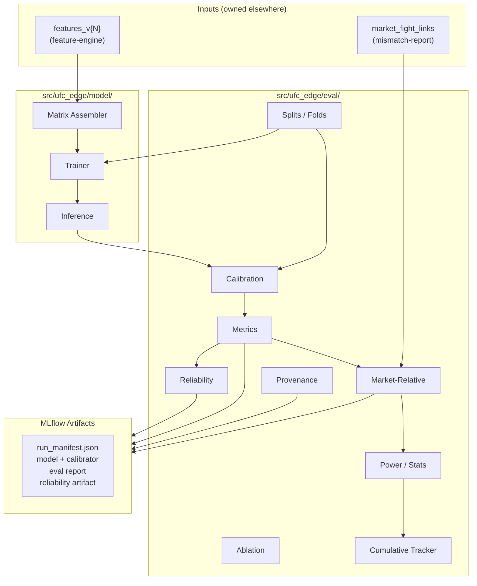

# Design Document — Model and Evaluation

## Overview

The model-and-eval layer transforms versioned per-fighter feature rows into calibrated
fight-level win probabilities, evaluates them against the market as a competing
forecaster, and logs everything to MLflow. It owns the full lifecycle from matrix
assembly through the stratified reliability artifact.

Two load-bearing design ideas anchor the implementation:

1. **Separation of fitting from scoring.** The matrix assembler, XGBoost trainer,
   calibrator selector, and evaluator are independent composable stages connected by
   typed data contracts — never by shared mutable state. Each stage can be tested
   against fixture data without running any upstream stage.

2. **Symmetry as an invariant, not a convention.** The canonical-order averaging
   protocol is baked into the inference path at the type level: the inference function
   returns a `SymmetricPrediction` that has already been verified for exact `p + (1−p) = 1`
   compliance. No downstream consumer constructs predictions from raw scores.

The eval/ module does not exist today (per code audit). This design defines it from
scratch alongside the model/ module's internal structure.

## Architecture



### Module layout

| Package | File | Responsibility |
|---|---|---|
| `src/ufc_edge/model/` | `__init__.py` | package API |
| | `schemas.py` | `AssemblyManifest`, `CandidateConfig`, `TrainResult` |
| | `matrix.py` | `assemble_matrix()`, ablation-subset logic, market-column guard |
| | `train.py` | `train_candidate()`, `select_best_candidate()` |
| | `inference.py` | `predict_symmetric()` → `SymmetricPrediction` |
| | `retrain.py` | retrain-after-event orchestration |
| `src/ufc_edge/eval/` | `__init__.py` | package API |
| | `schemas.py` | `Fold`, `EvaluationReport`, `ReliabilityBucket`, `AblationRungResult`, `PowerResult` |
| | `splits.py` | `generate_folds()`, holdout guard |
| | `calibration.py` | `fit_calibrators()`, `select_calibrator()`, Platt/isotonic/beta implementations |
| | `metrics.py` | `brier()`, `log_loss()`, `ece()`, `event_bootstrap_ci()`, `stratify_by_history_depth()` |
| | `reliability.py` | `stratified_reliability()` → bucket artifact |
| | `ablation.py` | `run_ablation_ladder()` |
| | `market_relative.py` | `compute_brier_skill()`, market join logic |
| | `power.py` | `minimum_detectable_effect()`, `paired_permutation_test()` |
| | `cumulative.py` | `update_cumulative_evidence()` |
| | `provenance.py` | MLflow logging orchestration |
| | `holdout.py` | final holdout evaluation + post-holdout lock |
| `configs/` | `model/default.yaml` | candidate configs, hyperparameter grid |
| | `eval/default.yaml` | fold count, min sizes, thresholds, sparse-history cutoff |

### Development-to-production deltas

| Aspect | Development | Production (retrain mode) |
|---|---|---|
| Folds | 3–4 expanding-window dev folds | Single expanding window: all pre-event history |
| Candidate selection | ~12 configs evaluated across folds | Locked config from dev selection |
| Calibrator | Selected per fold, plurality wins | Locked method from dev folds |
| Holdout | Excluded | Scored once after Aug 2026 |
| Market-relative | Dev folds only | Dev + holdout + cumulative post-holdout |

### Test ladder

| Layer | What is tested | Fixture source |
|---|---|---|
| Unit — schemas | Pydantic validation, frozen immutability | hand-crafted dicts |
| Unit — matrix | Market-column rejection, NULL→NaN, orientation mirroring, ablation subsets | 10-fight fixture table |
| Unit — splits | Event grouping, temporal ordering, holdout exclusion, sizing guard | synthetic event index |
| Unit — calibration | Platt/isotonic/beta correctness, selection logic, leakage guard | pre-computed logit vectors |
| Unit — metrics | Brier, log loss, ECE on known distributions | analytic fixtures |
| Unit — inference | Symmetry: `p(A,B) + p(B,A) = 1.0` | paired predictions |
| Unit — power | MDE formula against scipy reference | known n/σ pairs |
| Unit — permutation | Permutation test against known null/alternative | synthetic Brier-diff vectors |
| Integration — train | End-to-end train on fixture features → MLflow logged | 50-fight fixture DuckDB |
| Integration — eval | Full fold generation + eval on fixture → typed report | 200-fight fixture DuckDB |
| Property — symmetry | For any random pair `(A,B)`, `predict(A,B) + predict(B,A) = 1.0` | fuzz over fixture matrix |
| Property — determinism | Same config + data + seed → byte-identical model + metrics | repeated runs |
| Property — leakage | No test-set event date ≤ any train-set event date | all generated folds |

## Components and Interfaces

### Component 1 — Matrix Assembler (`model.matrix`)

Transforms per-fighter rows into fight-level training matrices. It does NOT train
models, apply calibration, or access market data.

```python
def assemble_matrix(
    features_table: str,          # DuckDB table name, e.g. "features_v1"
    feature_version: str,         # expected version, verified against table
    event_ids: frozenset[str],    # which events to include
    ablation_rung: AblationRung | None = None,  # optional subset
    con: duckdb.DuckDBPyConnection,
) -> AssemblyResult:
    """Returns (X: np.ndarray, y: np.ndarray, manifest: AssemblyManifest)."""
```

**Market-column guard:** A frozen set `MARKET_COLUMNS` (sourced from Section 16 of
the registry) is checked against the feature schema at assembly time. Any overlap
raises `MarketLeakageError`.

**NULL → NaN contract:** DuckDB `NULL` values are converted to `np.nan` during the
pandas/numpy extraction step. XGBoost's `missing=np.nan` parameter handles native
branching on missing data.

**Ablation rung mapping:**

| Rung | Families included |
|---|---|
| `NAIVE` | None (constant 0.5 floor) |
| `RECORD` | §3, §3a-ufcstats |
| `PHYSICAL` | + §1, §2 |
| `SCHEDULE_STRENGTH` | + §9a, §9a-bis, §9b, §9c |
| `DOMAIN_INTERACTIONS` | + §4/4a, §5/5a, §6, §8a/8b, §10/10a/10b, §11 |

`Validates: Requirements ME-1, ME-2`

### Component 2 — Trainer (`model.train`)

Owns XGBoost construction and candidate selection. It does NOT own fold generation,
calibration, or evaluation metrics.

```python
@dataclass(frozen=True)
class CandidateConfig:
    n_estimators: int
    learning_rate: float
    max_depth: int
    min_child_weight: float
    subsample: float
    colsample_bytree: float
    reg_alpha: float
    reg_lambda: float

def train_candidate(
    X_train: np.ndarray,
    y_train: np.ndarray,
    config: CandidateConfig,
    seed: int,
) -> xgb.Booster:
    """Fits one XGBoost model. No early stopping."""

def select_best_candidate(
    fold_results: list[FoldCandidateResult],
) -> CandidateConfig:
    """Selects by mean calibrated Brier; tiebreak log loss, then ECE."""
```

**Fixed-round invariant:** `num_boost_round` is set to `config.n_estimators` at call
time; `early_stopping_rounds` is never passed. XGBoost trains exactly the requested
rounds.

**Configuration schema (Hydra `configs/model/default.yaml`):**

```yaml
candidates:
  - {n_estimators: 200, learning_rate: 0.05, max_depth: 4, min_child_weight: 3,
     subsample: 0.8, colsample_bytree: 0.8, reg_alpha: 0.0, reg_lambda: 1.0}
  - {n_estimators: 300, learning_rate: 0.03, max_depth: 5, min_child_weight: 5,
     subsample: 0.7, colsample_bytree: 0.7, reg_alpha: 0.1, reg_lambda: 2.0}
  # ... ~12 total entries
random_seed: 42
objective: "binary:logistic"
eval_metric: "logloss"
```

`Validates: Requirements ME-3`

### Component 3 — Inference (`model.inference`)

Owns symmetric prediction. It does NOT own model training or calibrator fitting.

```python
@dataclass(frozen=True)
class SymmetricPrediction:
    fight_url: str
    canonical_fighter_url: str  # lexicographically smaller
    canonical_opponent_url: str
    p_calibrated: float         # P(canonical fighter wins)
    raw_p_ab: float
    raw_p_ba: float
    calibrator_method: str

def predict_symmetric(
    booster: xgb.Booster,
    calibrator: CalibratorProtocol,
    fighter_a_features: np.ndarray,
    fighter_b_features: np.ndarray,
    fighter_a_url: str,
    fighter_b_url: str,
) -> SymmetricPrediction:
    """Averages orientations, calibrates once, guarantees symmetry."""
```

**Canonical ordering rule:** `canonical_fighter_url = min(fighter_a_url, fighter_b_url)`
by lexicographic string comparison. The raw XGBoost prediction is computed for both
orderings; the canonical raw is `0.5 × (p_ab + (1 − p_ba))`. Calibration maps this
once. For the reversed query, return `1 − p_calibrated`.

`Validates: Requirements ME-6`

### Component 4 — Splits (`eval.splits`)

Owns fold generation and the holdout guard. It does NOT produce predictions or metrics.

```python
@dataclass(frozen=True)
class Fold:
    fold_id: int
    train_event_ids: frozenset[str]
    calibration_event_ids: frozenset[str]
    test_event_ids: frozenset[str]

def generate_folds(
    event_index: list[EventEntry],
    n_folds: int = 4,
    min_train_fights: int = 500,
    min_test_fights: int = 150,
    calibration_ratio: float = 0.20,
    calibration_min: int = 250,
    holdout_start: str = "2026-01-01",
    holdout_end: str = "2026-08-31",
) -> list[Fold]:
    """Expanding-window event-grouped folds. Raises if holdout is breached."""
```

**Calibration sizing rule (D22):** `cal_size = max(calibration_min, ceil(calibration_ratio × N))`
where N is the fold's total training-eligible fight count. The calibration slice is the
trailing `cal_size` unique fights by event date within the training window.

**Holdout guard:** Any event with `event_date` in `[holdout_start, holdout_end]` is
categorically excluded. If such an event is found in any partition, `HoldoutLeakageError`
is raised.

`Validates: Requirements ME-4, ME-13`

### Component 5 — Calibration (`eval.calibration`)

Owns calibrator fitting and per-fold selection. It does NOT own fold generation or
metric computation.

```python
class CalibratorProtocol(Protocol):
    method: str
    def transform(self, raw_probs: np.ndarray) -> np.ndarray: ...

def fit_calibrators(
    raw_probs: np.ndarray,
    labels: np.ndarray,
) -> dict[str, CalibratorProtocol]:
    """Returns {'platt': ..., 'isotonic': ..., 'beta': ...}."""

def select_calibrator(
    calibrators: dict[str, CalibratorProtocol],
    eval_raw_probs: np.ndarray,
    eval_labels: np.ndarray,
) -> tuple[str, CalibratorProtocol]:
    """Selects by ECE, Brier tiebreak. Returns (method_name, calibrator)."""
```

**Platt scaling:** Logistic regression on `logit(raw_prob)` with 2 parameters (slope, intercept).
Uses sklearn `LogisticRegression` with `solver='lbfgs'`, no penalty.

**Isotonic regression:** sklearn `IsotonicRegression(out_of_bounds='clip')`.

**Beta calibration:** 3-parameter fit `sigmoid(a·ln(s) − b·ln(1−s) + c)`. Implemented
via scipy `minimize` with L-BFGS-B on negative log-likelihood.

`Validates: Requirements ME-5`

### Component 6 — Metrics (`eval.metrics`)

Pure functions for scoring. No side effects, no MLflow, no DuckDB.

```python
def brier_score(probs: np.ndarray, labels: np.ndarray) -> float
def log_loss_score(probs: np.ndarray, labels: np.ndarray) -> float
def expected_calibration_error(probs: np.ndarray, labels: np.ndarray, n_bins: int = 10) -> float
def event_bootstrap_ci(
    predictions: list[FightPrediction],
    metric_fn: Callable,
    n_bootstrap: int = 5000,
    alpha: float = 0.05,
) -> tuple[float, float]:
    """Resamples events with replacement; includes all fights per sampled event."""

def stratify_by_history_depth(
    predictions: list[FightPrediction],
    threshold: int = 3,
) -> StratifiedMetrics:
    """Splits by min_prior_ufc_fights; reports Brier/ECE per stratum."""
```

`Validates: Requirements ME-7, ME-8.7, ME-10`

### Component 7 — Reliability (`eval.reliability`)

Produces the stratified reliability artifact.

```python
@dataclass(frozen=True)
class ReliabilityBucket:
    lower: float
    upper: float
    n_fights: int
    mean_predicted: float
    observed_win_rate: float
    calibration_error: float  # |mean_predicted − observed_win_rate|
    ci_lower: float           # 95% binomial CI on observed_win_rate
    ci_upper: float
    low_support: bool         # True if n_fights < 10

FIXED_BUCKETS = [(0.1, 0.3), (0.3, 0.5), (0.5, 0.7), (0.7, 0.9)]

def stratified_reliability(
    predictions: list[FightPrediction],
) -> list[ReliabilityBucket]:
    """Four fixed buckets with binomial CIs. Exposed for D34 gate consumption."""
```

**Binomial CI:** Clopper-Pearson exact interval at 95% confidence on the observed
win rate within each bucket.

`Validates: Requirements ME-14`

### Component 8 — Market-Relative Evaluation (`eval.market_relative`)

Joins model predictions with market probabilities for Brier-skill computation.

```python
def compute_brier_skill(
    model_predictions: list[FightPrediction],
    market_probs: dict[str, float],  # fight_url → market implied prob
) -> MarketRelativeResult:
    """Computes Brier_skill = 1 − (Brier_model / Brier_market)."""
```

**Join contract:** Reads `market_fight_links` where `match_status = 'MATCHED'`. Fights
without a matched market probability are excluded from market-relative metrics but
included in absolute model metrics. Exclusion count is reported.

`Validates: Requirements ME-7`

### Component 9 — Power and Statistical Testing (`eval.power`)

```python
def minimum_detectable_effect(
    n_fights: int,
    sigma: float,    # estimated SD of per-fight Brier differences
    alpha: float = 0.05,
    power: float = 0.8,
) -> float:
    """Returns MDE in Brier-skill units."""

def paired_permutation_test(
    model_brier_per_fight: np.ndarray,
    market_brier_per_fight: np.ndarray,
    n_permutations: int = 10_000,
    seed: int = 42,
) -> PermutationResult:
    """Two-sided test. Returns observed_diff, p_value, null_distribution."""
```

**MDE formula:** Based on the standard power formula for paired differences:
`MDE = (z_alpha + z_beta) × σ / √n` where σ is the standard deviation of per-fight
Brier differences, estimated from development folds.

`Validates: Requirements ME-8`

### Component 10 — Ablation (`eval.ablation`)

Orchestrates the ladder evaluation.

```python
@dataclass(frozen=True)
class AblationRungResult:
    rung: AblationRung
    brier: float
    brier_ci: tuple[float, float]
    delta_brier: float | None      # None for first rung (naive)
    delta_ci: tuple[float, float] | None
    significant: bool | None       # CI excludes zero

def run_ablation_ladder(
    folds: list[Fold],
    config: CandidateConfig,
    features_table: str,
    con: duckdb.DuckDBPyConnection,
) -> list[AblationRungResult]:
    """Trains all rungs on identical folds; returns incremental metrics."""
```

`Validates: Requirements ME-2, ME-9`

### Component 11 — Cumulative Evidence Tracker (`eval.cumulative`)

Maintains a running Brier-skill-vs-market time series after the holdout.

```python
def update_cumulative_evidence(
    prior_series: list[CumulativePoint],
    new_predictions: list[FightPrediction],
    new_market_probs: dict[str, float],
) -> list[CumulativePoint]:
    """Appends new events, recomputes running Brier-skill with CI bands."""
```

`Validates: Requirements ME-8.5`

### Component 12 — Provenance (`eval.provenance`)

Orchestrates MLflow logging. It does NOT compute metrics — it receives typed results
and logs them.

```python
def log_training_run(
    config: ResolvedConfig,
    booster: xgb.Booster,
    calibrator: CalibratorProtocol,
    folds: list[Fold],
    eval_report: EvaluationReport,
    reliability: list[ReliabilityBucket],
    ablation: list[AblationRungResult] | None,
    manifest: AssemblyManifest,
) -> str:
    """Returns MLflow run_id. Writes run_manifest.json."""
```

`Validates: Requirements ME-11`

## Data Models

### AssemblyManifest

```
AssemblyManifest {
    n_rows:              int                    // total training examples (2× fights)
    n_features:          int                    // column count
    feature_version:     str                    // e.g. "v1"
    feature_source_hash: str                    // SHA-256 of feature package source
    columns:             list[str]              // ordered column names
    exclusions:          dict[str, int]         // reason → count
    ablation_rung:       str | None             // rung name if subset
    assembled_at:        datetime
}
```

### EvaluationReport

```
EvaluationReport {
    run_id:              str                    // MLflow run ID
    fold_metrics:        list[FoldMetrics]      // per-fold scores
    pooled_brier:        float
    pooled_log_loss:     float
    pooled_ece:          float
    brier_ci:            tuple[float, float]    // event-bootstrap
    log_loss_ci:         tuple[float, float]
    brier_skill:         float | None           // None if no market data
    brier_skill_ci:      tuple[float, float] | None
    mde:                 float                  // minimum detectable effect
    permutation_p:       float | None           // paired test p-value
    sparse_history_brier: float | None          // SPARSE_HISTORY stratum
    n_fights:            int
    n_excluded:          int
    holdout:             bool                   // True if final holdout
    evaluated_at:        datetime
}
```

### FoldMetrics

```
FoldMetrics {
    fold_id:             int
    n_train_fights:      int
    n_cal_fights:        int
    n_test_fights:       int
    brier:               float
    log_loss:            float
    ece:                 float
    calibrator_method:   str                   // winner for this fold
    all_calibrator_scores: dict[str, dict]     // method → {ece, brier, log_loss}
}
```

### SymmetricPrediction

```
SymmetricPrediction {
    fight_url:                str
    canonical_fighter_url:    str               // lexicographically smaller
    canonical_opponent_url:   str
    p_calibrated:             float             // P(canonical wins)
    raw_p_ab:                 float
    raw_p_ba:                 float
    calibrator_method:        str
}
```

### ReliabilityBucket

```
ReliabilityBucket {
    lower:               float
    upper:               float
    n_fights:            int
    mean_predicted:      float
    observed_win_rate:   float
    calibration_error:   float
    ci_lower:            float                 // Clopper-Pearson 95%
    ci_upper:            float
    low_support:         bool
}
```

### PowerResult

```
PowerResult {
    n_fights:            int
    estimated_sigma:     float
    mde:                 float                 // at alpha=0.05, power=0.8
    alpha:               float
    power:               float
}
```

### PermutationResult

```
PermutationResult {
    observed_diff:       float                 // mean(model_brier_i - market_brier_i)
    p_value:             float
    n_permutations:      int
    ci_lower:            float                 // bootstrap CI on observed diff
    ci_upper:            float
}
```

### AblationRungResult

```
AblationRungResult {
    rung:                str                   // AblationRung enum value
    brier:               float
    brier_ci:            tuple[float, float]
    delta_brier:         float | None          // None for naive (first rung)
    delta_ci:            tuple[float, float] | None
    significant:         bool | None           // CI excludes zero
}
```

### CumulativePoint

```
CumulativePoint {
    as_of_event_url:     str
    as_of_date:          date
    cumulative_n_fights: int
    brier_skill:         float
    ci_lower:            float
    ci_upper:            float
}
```

## Hydra Configuration

### `configs/model/default.yaml`

```yaml
candidates:
  - {n_estimators: 200, learning_rate: 0.05, max_depth: 4, min_child_weight: 3,
     subsample: 0.8, colsample_bytree: 0.8, reg_alpha: 0.0, reg_lambda: 1.0}
  - {n_estimators: 300, learning_rate: 0.03, max_depth: 5, min_child_weight: 5,
     subsample: 0.7, colsample_bytree: 0.7, reg_alpha: 0.1, reg_lambda: 2.0}
  - {n_estimators: 150, learning_rate: 0.08, max_depth: 3, min_child_weight: 1,
     subsample: 0.9, colsample_bytree: 0.9, reg_alpha: 0.0, reg_lambda: 0.5}
  - {n_estimators: 400, learning_rate: 0.02, max_depth: 6, min_child_weight: 5,
     subsample: 0.7, colsample_bytree: 0.6, reg_alpha: 0.5, reg_lambda: 3.0}
  - {n_estimators: 250, learning_rate: 0.04, max_depth: 4, min_child_weight: 2,
     subsample: 0.85, colsample_bytree: 0.75, reg_alpha: 0.05, reg_lambda: 1.5}
  - {n_estimators: 350, learning_rate: 0.025, max_depth: 5, min_child_weight: 4,
     subsample: 0.75, colsample_bytree: 0.8, reg_alpha: 0.2, reg_lambda: 2.5}
  - {n_estimators: 200, learning_rate: 0.06, max_depth: 3, min_child_weight: 2,
     subsample: 0.8, colsample_bytree: 0.85, reg_alpha: 0.0, reg_lambda: 0.8}
  - {n_estimators: 300, learning_rate: 0.035, max_depth: 6, min_child_weight: 3,
     subsample: 0.65, colsample_bytree: 0.7, reg_alpha: 0.3, reg_lambda: 2.0}
  - {n_estimators: 250, learning_rate: 0.045, max_depth: 5, min_child_weight: 3,
     subsample: 0.8, colsample_bytree: 0.75, reg_alpha: 0.1, reg_lambda: 1.2}
  - {n_estimators: 400, learning_rate: 0.02, max_depth: 4, min_child_weight: 5,
     subsample: 0.7, colsample_bytree: 0.65, reg_alpha: 0.5, reg_lambda: 4.0}
  - {n_estimators: 150, learning_rate: 0.07, max_depth: 4, min_child_weight: 1,
     subsample: 0.9, colsample_bytree: 0.9, reg_alpha: 0.0, reg_lambda: 0.3}
  - {n_estimators: 300, learning_rate: 0.03, max_depth: 5, min_child_weight: 4,
     subsample: 0.8, colsample_bytree: 0.8, reg_alpha: 0.15, reg_lambda: 1.8}
random_seed: 42
objective: "binary:logistic"
eval_metric: "logloss"
```

### `configs/eval/default.yaml`

```yaml
n_folds: 4
min_train_fights: 500
min_test_fights: 150
calibration_ratio: 0.20
calibration_min: 250
holdout_start: "2026-01-01"
holdout_end: "2026-08-31"
label_start_date: "2010-01-01"
bootstrap_n: 5000
bootstrap_alpha: 0.05
permutation_n: 10000
sparse_history_threshold: 3
```

## Error Handling

Ranked by danger:

1. **Holdout leakage** — Any access to 2026 holdout events during development raises
   `HoldoutLeakageError` immediately. This is the most critical failure because it
   invalidates the entire final evaluation.

2. **Market-column leakage** — If the assembler detects a market-derived column in
   the feature schema, `MarketLeakageError` fires before matrix construction. This
   protects the odds-free constraint (D24).

3. **Calibration slice undersized** — If the calibration partition has fewer than
   `max(250, ceil(20% × N))` unique fights, `CalibrationSizingError` fires before
   any calibrator is fitted. Proceeding would produce unreliable probability maps.

4. **Post-holdout lock violation** — After `holdout_evaluated_at` is written, any
   attempt to change model selection, calibrator, or hyperparameters raises
   `PostHoldoutLockError`. This preserves holdout integrity.

5. **Schema mismatch** — Feature version mismatch or missing columns raises
   `SchemaMismatchError`. Silently proceeding with wrong features produces
   meaningless metrics.

6. **MLflow write failure** — A failed artifact write marks the run as failed and
   prevents downstream consumption. No half-logged runs are exposed.

7. **Missing market data** — Fights without market-linked probabilities are excluded
   from market-relative metrics only (not from absolute model metrics). Exclusion
   counts are reported.

## Correctness Properties

### Property 1: Exact order symmetry

*For any* fight (A, B), `predict_symmetric(model, cal, A_feat, B_feat, url_A, url_B).p_calibrated + predict_symmetric(model, cal, B_feat, A_feat, url_B, url_A).p_calibrated = 1.0` to floating-point equality. Tested by property-based fuzzing over the full fixture matrix.

**Validates: Requirements ME-6.5**

### Property 2: No temporal leakage in folds

*For any* generated fold, every event in the training set has `event_date` strictly before the earliest event date in the calibration set, and every calibration event has `event_date` strictly before the earliest test event date. No event appears in more than one partition.

**Validates: Requirements ME-4.2**

### Property 3: Calibration isolation

*For any* fold, the calibration slice is disjoint from both the model-fitting partition and the test partition. Labels from the test partition never reach model fitting or calibrator fitting.

**Validates: Requirements ME-4.6, ME-5.6**

### Property 4: Fixed-round invariant

*For any* trained model, the number of trees in the booster equals exactly `config.n_estimators`. No early-stopping parameter is ever passed to XGBoost.

**Validates: Requirements ME-3.1**

### Property 5: Market-column exclusion

*For any* assembled matrix, the intersection of its column set with `MARKET_COLUMNS` is empty.

**Validates: Requirements ME-1.2**

### Property 6: Holdout immutability

*After* `holdout_evaluated_at` is written, no subsequent call to model selection, calibrator selection, or hyperparameter tuning succeeds.

**Validates: Requirements ME-13.3, ME-13.4**

### Property 7: NULL → NaN completeness

*For any* assembled matrix, no DuckDB `NULL` value survives as a Python `None` — all are converted to `np.nan`.

**Validates: Requirements ME-1.4**

### Property 8: Deterministic folds

*For any* event index and configuration, `generate_folds()` called twice produces identical fold objects. Same-date tie-breaking is deterministic by `event_url`.

**Validates: Requirements ME-4.7**

### Property 9: Ablation ladder nesting

*For any* ablation run, the column set of rung `k` is a strict superset of rung `k-1`. The naive rung has zero columns.

**Validates: Requirements ME-2.1–ME-2.5**

### Property 10: Bootstrap respects event grouping

*For any* bootstrap iteration, resampling selects events (not individual fights), and all fights from a selected event are included.

**Validates: Requirements ME-8.7**

### Property 11: Calibrator selection never touches test

*For any* fold, calibrator selection uses only the calibration slice and the fold's evaluation slice (from training-window events). The test-set labels are never visible to the selection logic.

**Validates: Requirements ME-5.2, ME-5.6**

### Property 12: Framing rule enforcement

*When* the permutation test p-value does not clear α=0.05, the evaluation report text does not contain the phrase "beats the market" or equivalent claim language.

**Validates: Requirements ME-8.3**

## Testing Strategy

- **Fixture-based only** (per AGENTS.md): all tests use synthetic DuckDB databases with known fight/event/feature rows. No live data, no network calls.
- **Property tests** use hypothesis or manual fuzz loops with documented iteration counts.
- **Integration tests** run the full train/evaluate pipeline on a 50–200 fight fixture database and verify the output schema, MLflow logging, and correctness invariants.
- **Leakage tests** are first-class: dedicated tests verify market-column guard, holdout guard, and temporal ordering at the fold level.
- **Determinism tests** run the same pipeline twice with identical seeds and verify byte-identical model artifacts and metrics.
- **Symmetry tests** exercise predict_symmetric with random pairs and verify exact complement.

## Standing Decisions with Named Fallbacks

1. **Fixed ~12-candidate random search.** If development fold variance exceeds 15% relative Brier between folds, evaluate whether doubling candidate count reduces selection noise before adding hyperparameters.

2. **Beta calibration as expected winner.** If beta consistently overfits (worse Brier on eval slice than Platt across ≥3 folds), investigate regularization before removing it as a candidate.

3. **Paired permutation test for market comparison.** If holdout fight count exceeds 1,000, evaluate whether a bootstrapped t-test provides tighter intervals before switching approaches.

4. **Four development folds.** If event history before 2026 cannot support 4 folds with ≥150 test fights each, fall back to 3 folds.
